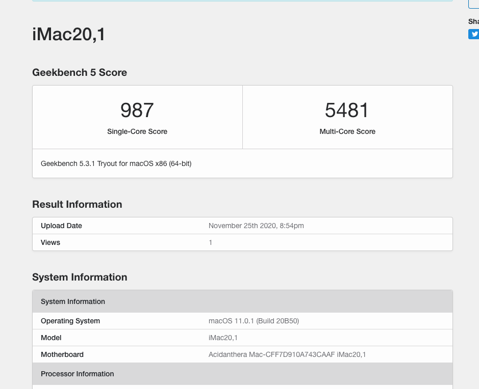
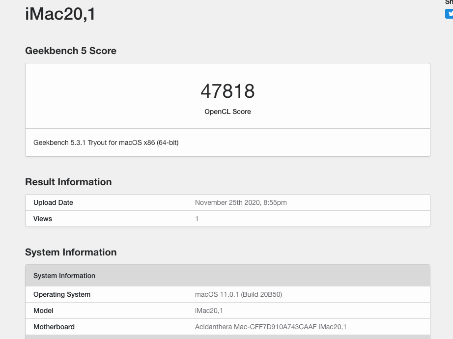

# MPG Z490 GAMING PLUS i5 10400 OPENCORE 0.6.3
Hello,

I have successfully installed MacOS on my i5 10400 non K on MPG Z490 GAMING PLUS.

**Current Bootloader: OpenCore 0.6.3**

# Hardware

- Intel I5 10700
- MPG Z490 GAMING PLUS
	- Audio: Realtek® ALC1200-VD1 Codec
	- Realtek® RTL8125B-CG 2.5G LAN Controller
- RAM: 16GB DDR4 CORSAIR VENGEANCE LPX 16GB 3000MHZ
- GPU: MSI RX 580 8GB
- BCM94360 for WiFi/Bluetooth . Link Shopee Vn : https://shopee.vn/product/106323333/2610880710

# Geekbench

# Working

- [x] **Tested with macOS Big Sur 11.0.1**
- [x] **Audio** Realtek ALC1200-VD1 (AppleALC.kext, layout-id=11)
- [x] **iGPU UHD630 Headless mode**
- [x] **RX 580 works OOB no kext used**
- [x] **iMessage/FaceTime**
- [x] **WiFi/Bluetooth, Handoff and AirDrop** BCM94360 (no kext required)
- [x] **Sleep/Wake**
- [x] **Shutdown**
- [x] **Restart**

# Instructions

BIOS Settings:

- Disable CFG Lock
- Disable Fastboot 
- Enable XMP Profile for RAM
- Enable Above 4G decoding
- Enable iGPU 64MB

1. Create a MacOS Big Sur bootable USB. You can do this on a real Mac
 	 - Go into the app store and search for macOS Big Sur, once downloaded you can find the Installer.app inside Applications folder.
   - Earse the USB by using Disk Utility and rename the USB to MyVolume
   - Create bootable USB by using this command: sudo /Applications/Install\ macOS\ Big\ Sur.app/Contents/Resources/createinstallmedia --volume /Volumes/MyVolume
  
2. Mount the EFI-partition of the "Install macOS Big Sur" disk.
   - You can do this using the Terminal with the following commands:
   - diskutil list
   - Once you have found the disk for example disk0s1 runt the following command to mount the EFI partition:
   - sudo diskutil mount disk0s1
   - Enter the password and the EFI partition should be mounted 
   
3. Delete all folders and then copy my EFI folder to the root of the EFI-partition
4. Go to EFI/OC and open the config.plist with a plist Editor (You can use PlistEditor Pro use google for this)
5. Once the config.plist is open navigate to PlatformInfo/Generic and paste your serials for MLB, SystemSerialNumber and SystemUUID. (you can use CorpNewt's GenSMBIOS)
6. Boot from the bootable USB and install macOS.
7. Once macOS is installed you can copy the EFI folder to the EFI partition of the internal SSD/HDD